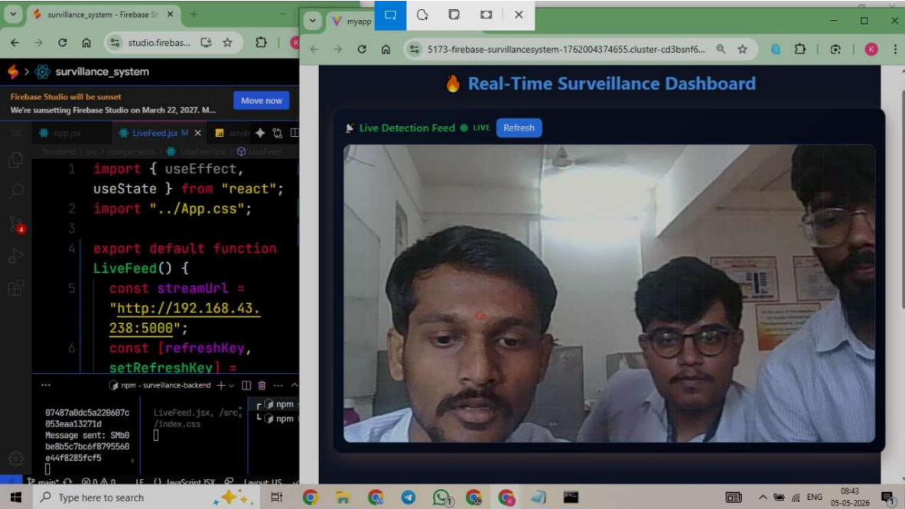
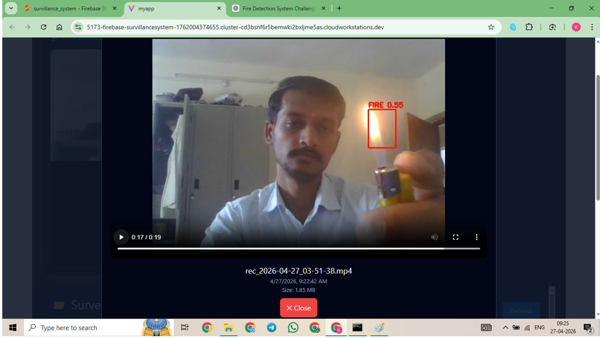
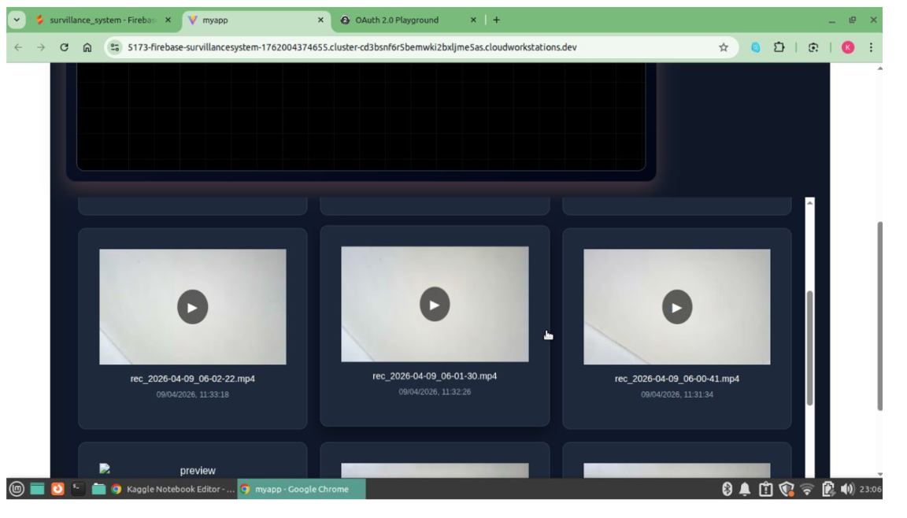

# Surveillance System Admin

This repository contains the admin-side application for the surveillance system. It provides a web dashboard for monitoring live fire-detection streams, handling alerts from the client/edge device, and browsing recorded video clips that are uploaded for later review.

## Overview

The admin project is split into two parts:

- a React + Vite frontend dashboard, and
- an Express backend that receives alerts, manages stream URLs, and exposes recorded video data.

It works together with the client-side Raspberry Pi / edge system to provide:

- live camera monitoring,
- alert notifications from the edge device,
- recording and archive management,
- playback of stored surveillance videos.

## Features

- Real-time surveillance dashboard UI
- Live feed panel to view the camera stream
- Alert handling for fire detection events
- Pause alert action for the connected device
- Recording archive with video browsing and playback
- Google Drive integration for uploaded video files
- Backend endpoints for status, alerts, and video listing

## Project Structure

```text
surveillance-system-Admin/
├── frontend/                  # React + Vite admin dashboard
│   ├── src/
│   │   ├── App.jsx
│   │   └── components/
│   ├── package.json
│   └── vite.config.js
├── surveillance-backend/      # Express + Node.js backend
│   ├── server.js
│   ├── recording.js
│   ├── piDemo.js
│   └── package.json
├── images/                    # Screenshots used in documentation
└── README.md
```

## Tech Stack

### Frontend

- React
- Vite
- Axios
- React Player
- Socket.IO client

### Backend

- Node.js
- Express
- CORS
- FFmpeg
- Google Drive API
- dotenv
- Twilio integration support

## Prerequisites

Before running the project, make sure you have:

- Node.js installed
- npm installed
- FFmpeg installed and available in your system PATH
- Google Drive API credentials configured in the backend environment
- A working client-side stream URL or public stream endpoint

## Environment Variables

Create a `.env` file inside the backend folder and configure the values you need, for example:

```env
GOOGLE_CLIENT_ID=your_google_client_id
GOOGLE_CLIENT_SECRET=your_google_client_secret
GOOGLE_REFRESH_TOKEN=your_google_refresh_token
```

If SMS or Twilio features are used, add the required Twilio environment variables as well.

## Installation

### 1) Install frontend dependencies

```bash
cd frontend
npm install
```

### 2) Install backend dependencies

```bash
cd surveillance-backend
npm install
```

## Running the Project

### Start the backend

```bash
cd surveillance-backend
npm run dev
```

The backend will start on:

```text
http://localhost:5000
```

### Start the frontend

```bash
cd frontend
npm run dev
```

The Vite app will usually open at:

```text
http://localhost:5173
```

## Main Backend Endpoints

The backend exposes the following important endpoints:

| Method | Endpoint              | Description                                                |
| ------ | --------------------- | ---------------------------------------------------------- |
| POST   | `/update-link`        | Receives the public stream URL from the client-side device |
| POST   | `/fire-alert`         | Stores a fire alert from the edge device                   |
| POST   | `/pause-alert`        | Pauses/blocks alert actions for the device                 |
| GET    | `/status`             | Returns the current system status and recent alerts        |
| POST   | `/esp-sensor-trigger` | Handles ESP8266 sensor-trigger events                      |
| GET    | `/all-videos`         | Returns a list of uploaded videos for the gallery          |
| GET    | `/stream/:id`         | Streams a recorded video file from Google Drive            |

## Frontend Features

The admin frontend dashboard includes:

- a live feed section that loads the client stream directly,
- a refresh button to reload the live frame,
- a pause alert button for sending a pause request to the edge device,
- a gallery view for archived recordings.

## Recording Flow

1. The backend receives the stream URL from the client-side device.
2. FFmpeg starts recording segments from the live stream.
3. Recorded segments are uploaded to Google Drive.
4. The frontend loads the uploaded video list and allows playback.

## Screenshots

The screenshots below are already available in the images folder:







## Notes

- The frontend currently points to `http://localhost:5000` for backend requests; update the URL if your server runs elsewhere.
- FFmpeg must be installed properly for recording and stream processing.
- The admin project depends on the client-side device sending its stream URL to the backend.
- Google Drive upload and public video streaming require valid API credentials.

## Author

Karan Gade

## License

This project is intended for educational and demonstration purposes. Adjust the license as needed for your deployment environment.
